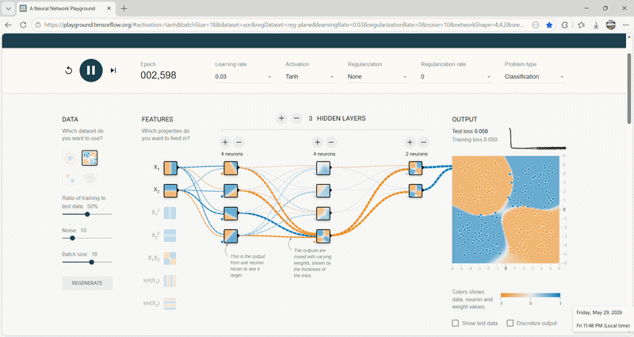

AI for detecting breast cancer from images===[BreastMNIST](https://github.com/parnia-alipour/deep_learning_project/blob/master/BreastMNIST.ipynb)

AI for Persian-to-English language translation===(Sequence-to-sequence)[Translator](https://github.com/parnia-alipour/deep_learning_project/blob/master/Translator.ipynb)

َAI for predicting Bitcoin prices (trained with the LSTM algorithm)===[BTC](https://github.com/parnia-alipour/deep_learning_project/blob/master/BTC.ipynb)

AI for Thalassemia Disease Prediction Using a Simple Dense Architecture Only===[thalassemia](https://github.com/parnia-alipour/deep_learning_project/blob/master/thalassemia_prediction.ipynb)

AI for Predicting Engine Failure Time (Using All 4 Datasets with Different Scenarios)===[nasa](https://github.com/parnia-alipour/deep_learning_project/blob/master/NASA_engine_rul_prediction.ipynb)

AI for Liver Tumor Disease Detection (implemented Conv2D)===[kidney_tumor](https://github.com/parnia-alipour/deep_learning_project/blob/master/kidney_tumor_prediction.ipynb)
### In deep learning, what happens?

[Site address](https://playground.tensorflow.org/#activation=tanh&batchSize=18&dataset=xor&regDataset=reg-plane&learningRate=0.03&regularizationRate=0&noise=10&networkShape=4,4,2&seed=0.66940&showTestData=false&discretize=false&percTrainData=50&x=true&y=true&xTimesY=false&xSquared=false&ySquared=false&cosX=false&sinX=false&cosY=false&sinY=false&collectStats=false&problem=classification&initZero=false&hideText=false)